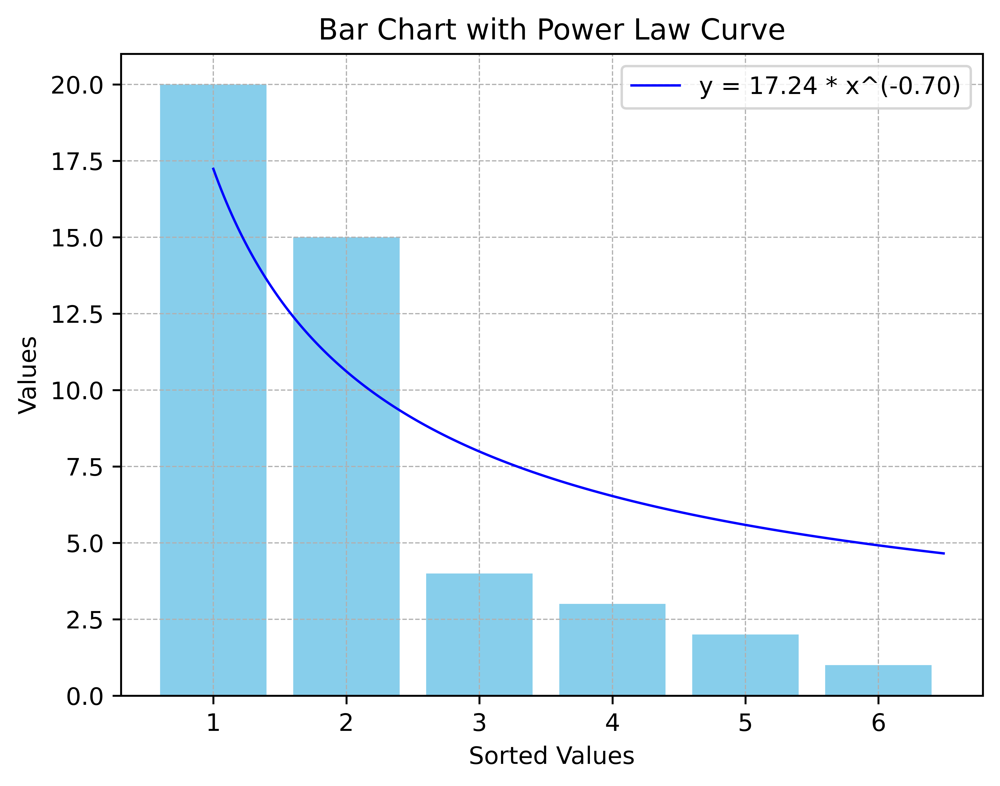
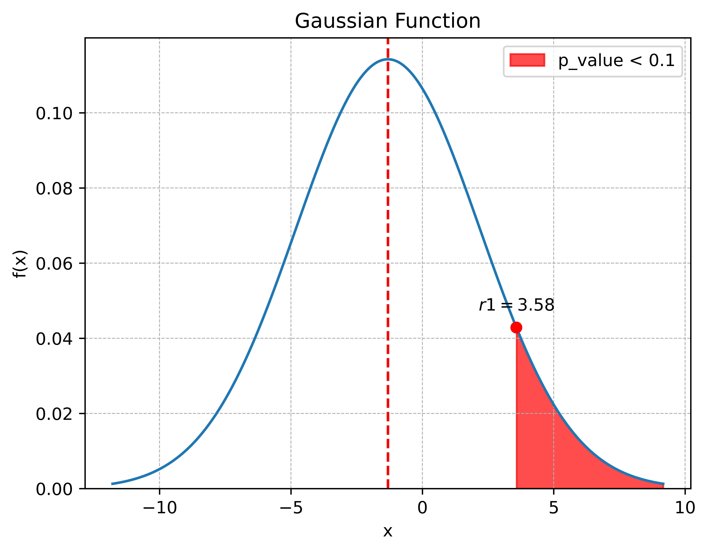
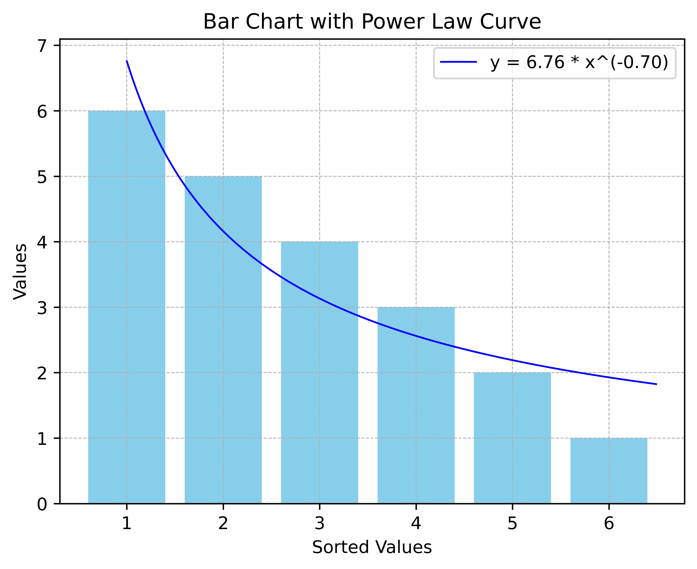
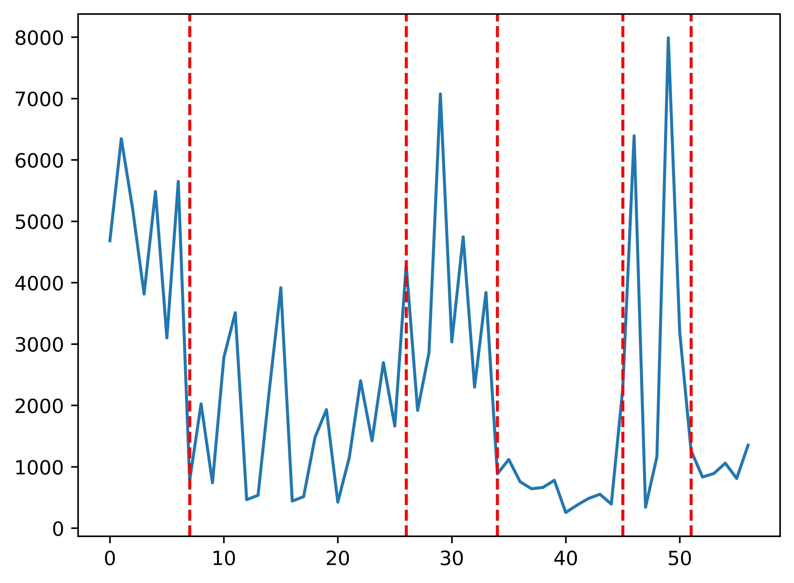
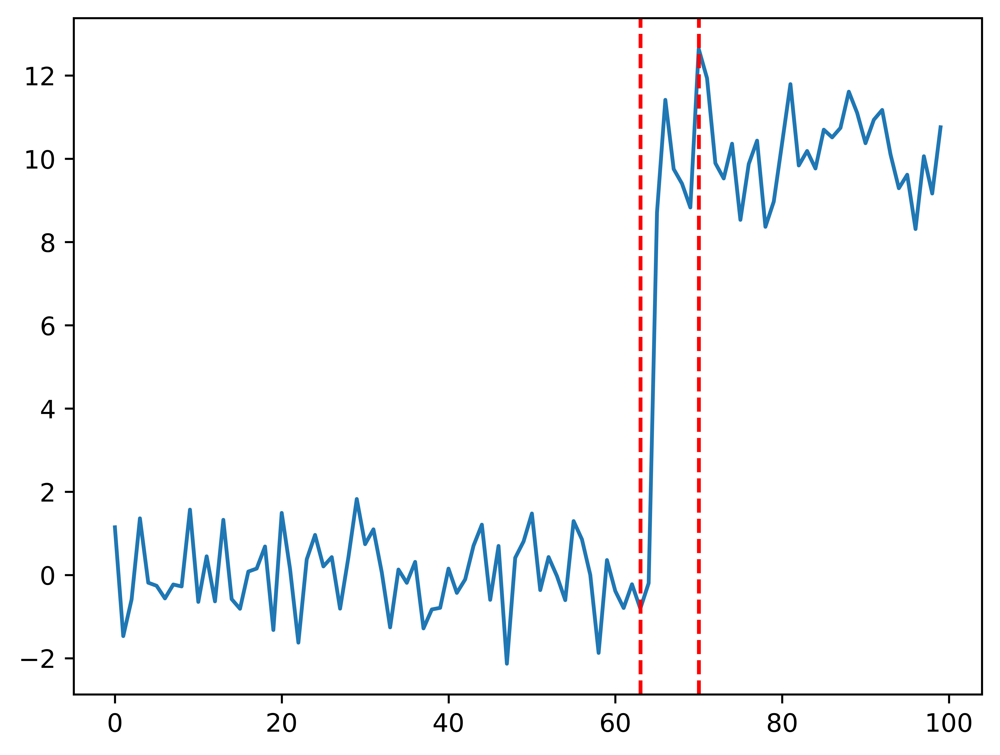
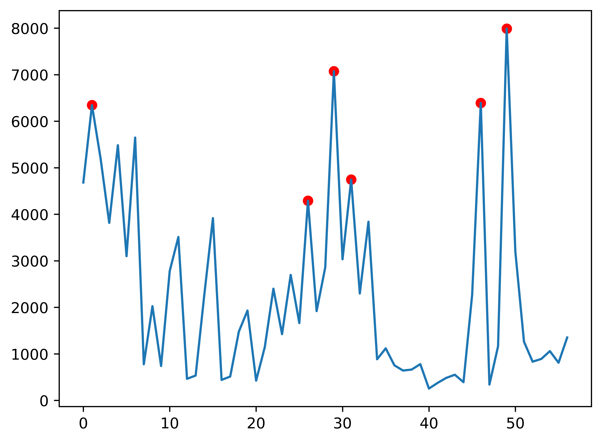
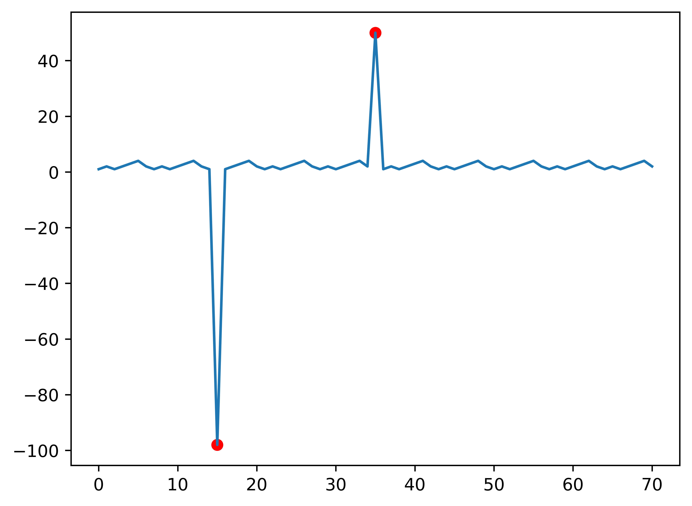

# Readme

## 1. Single Point Detection
### 1.1 Attribution Detection
### 1.2 Outstanding_1 Detection
### 1.3 Outstanding_2 Detection
**Outstanding_2 Data**

**Not Outstanding_2 Data**

## 2. Single Shape Detection
### 2.1 change_point_detection [**ruptures**](https://centre-borelli.github.io/ruptures-docs/)
**Normal Data**

**Standard Change Point Data**

### 2.2 outlier_detection
[**alibi-detect-SpectralResidual**](https://docs.seldon.io/projects/alibi-detect/en/latest/api/alibi_detect.od.html#alibi_detect.od.SpectralResidual)
**Normal Data**

**Standard Outlier Data**

### 2.3 seasonality_detection

### 2.4 trend_detection

## 3. Compound Detection