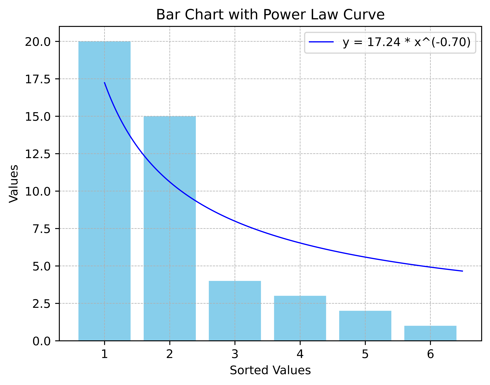
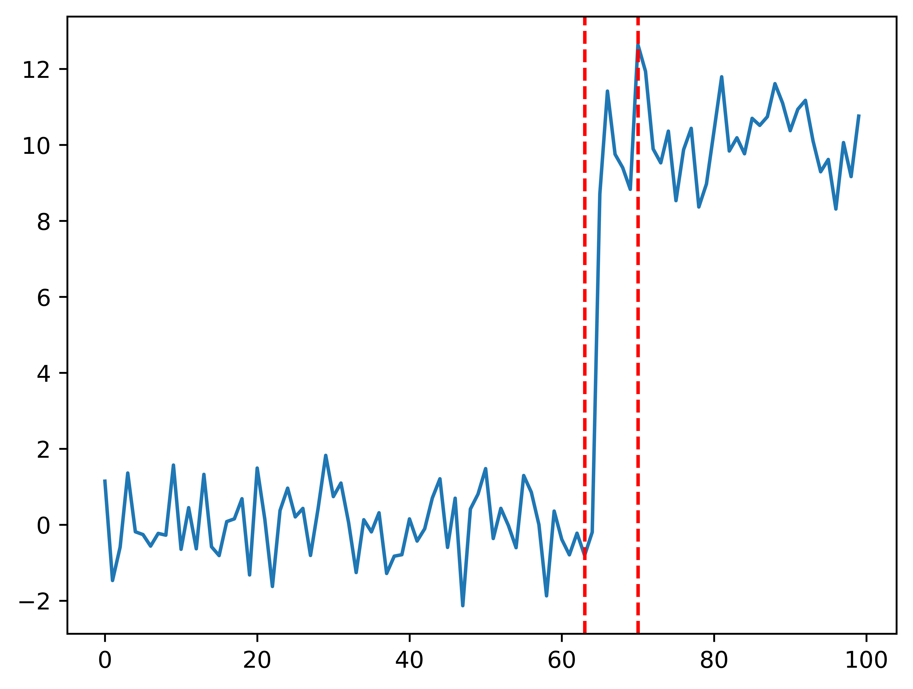

# Readme

## 1. Single Point Detection
### 1.1 Attribution Detection
### 1.2 Outstanding_1 Detection
### 1.3 Outstanding_2 Detection
**Outstanding_2 Data**

**Not Outstanding_2 Data**

## 2. Single Shape Detection
### 2.1 change_point_detection

